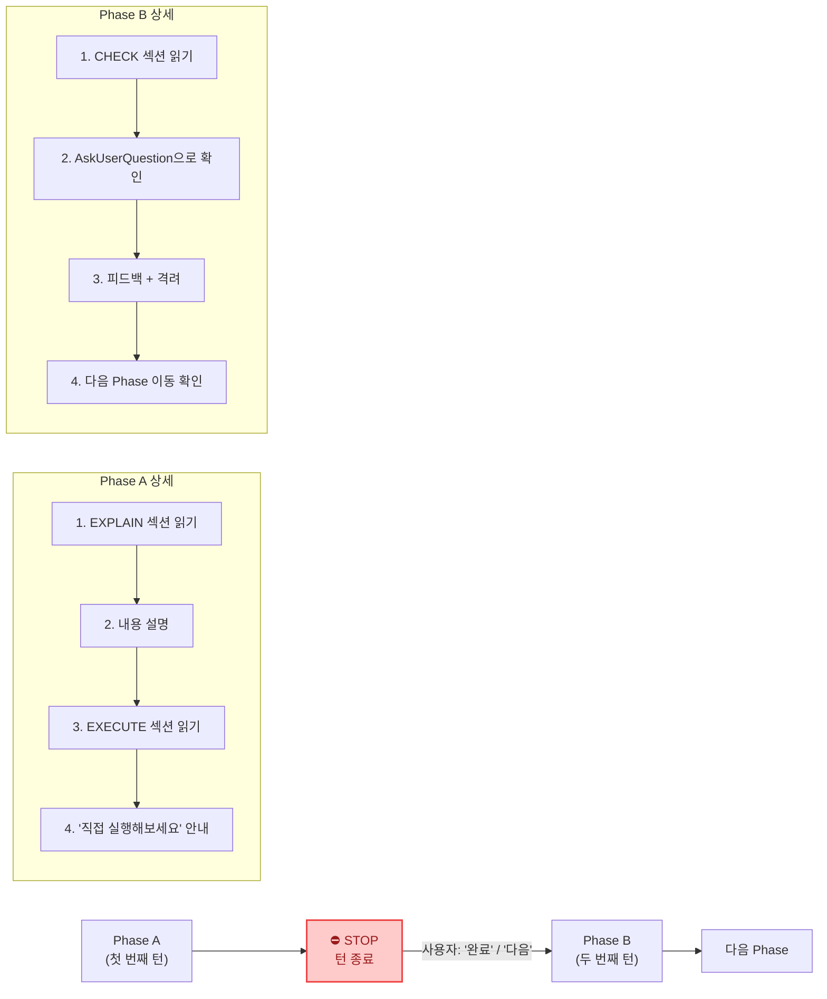
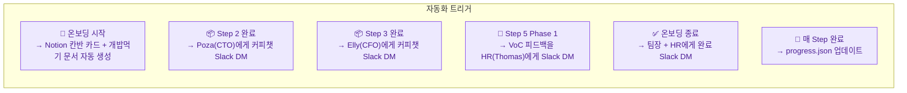

# 온보딩 시나리오 플로우

> 신규입사자가 `/onboarding`을 실행한 뒤 전체 여정을 한눈에 보여주는 다이어그램.

## 전체 흐름도

```mermaid
flowchart TD
    %% 시작
    START(["/onboarding 실행"]) --> INIT["닉네임 / 직무 / 소속 팀 입력<br/>progress.json 생성<br/>Notion 칸반 카드 자동 생성"]

    INIT --> S0

    %% ── Step 0 ──
    subgraph S0 ["Step 0 — 환경 설정"]
        direction TB
        S0P0["Phase 0 · 로드맵<br/>온보딩 전체 일정 안내"]
        S0P1["Phase 1 · MCP 연결<br/>Notion / Slack / Gmail / Calendar"]
        S0P2["Phase 2 · Claude Code 사용 팁<br/>Output Style · 상태바 · /compact"]
        S0P0 --> S0P1 --> S0P2
    end

    S0 -->|"/clear → /onboarding 이어하기"| S1

    %% ── Step 1 ──
    subgraph S1 ["Step 1 — General Onboarding"]
        direction TB
        S1P1["Phase 1 · 컬쳐덱<br/>조직 문화 + 일하는 방식"]
        S1P2["Phase 2 · 업무 도구 세팅<br/>Slack / Google / {{HR_SYSTEM}} / {{OFFICE_APP}}"]
        S1P3["Phase 3 · Slack 인사<br/>#general 자기소개 보내기"]
        S1P1 --> S1P2 --> S1P3
    end

    S1 -->|"자동화 제안 → 새 세션"| S2

    %% ── Step 2 ──
    subgraph S2 ["Step 2 — Product Onboarding"]
        direction TB
        S2P0["Phase 0 · 조직 소개<br/>제품팀 + 개발팀 구조"]
        S2P1["Phase 1 · 제품 체험<br/>서비스 제공자 + 이용자 관점<br/>📝 개밥먹기 노션 문서 작성"]
        S2P2["Phase 2 · AI 개선안<br/>(선택) Claude가 분석한 제품 개선 제안"]
        S2P0 --> S2P1 --> S2P2
    end

    S2 -->|"☕ Poza(CTO)에게 커피챗 DM"| S3

    %% ── Step 3 ──
    subgraph S3 ["Step 3 — Biz Onboarding"]
        direction TB
        S3P0["Phase 0 · 조직 소개<br/>사업팀 + 경영관리팀 구조"]
        S3P1["Phase 1 · BM 학습<br/>비즈니스 모델 + 경쟁 포지셔닝<br/>시장 데이터 + 용어집 + 고객 여정"]
        S3P2["Phase 2 · 시나리오 퀘스트<br/>🔀 팀별 분기: 타 팀 연계 시나리오 2개<br/>→ Slack DM 인사 퀘스트"]
        S3P3["Phase 3 · 팀별 심화<br/>소속 팀 BM 연결 + 업무 도구"]
        S3P0 --> S3P1 --> S3P2 --> S3P3
    end

    S3 -->|"☕ Elly(CFO)에게 커피챗 DM"| S4

    %% ── Step 4 ──
    subgraph S4 ["Step 4 — Build Your First Skill"]
        direction TB
        S4P1["Phase 1 · 스킬 해부<br/>기존 스킬 구조 분석 + Git 개념"]
        S4P2["Phase 2 · 스킬 설계<br/>🔀 팀별 아이디어 제안<br/>문제 정의 + 입출력 + 단계 설계"]
        S4P3["Phase 3 · 구현 + PR<br/>SKILL.md 작성 + eval 작성<br/>GitHub PR 제출"]
        S4P1 --> S4P2 --> S4P3
    end

    S4 --> S5

    %% ── Step 5 ──
    subgraph S5 ["Step 5 — Wrap Up"]
        direction TB
        S5P1["Phase 1 · 회고 + VoC<br/>오픈 대화로 온보딩 회고<br/>📨 피드백을 HR(Thomas)에게 Slack DM"]
        S5P2["Phase 2 · 킥오프 조언<br/>팀 합류 전 가벼운 조언"]
        S5P1 --> S5P2
    end

    S5 --> EXTRACT{"핵심 콘텐츠<br/>추출 동의?"}
    EXTRACT -->|"응"| ONBOARD_EXTRACT["onboarding-extract 스킬 실행<br/>상시 참조용 MD 생성"]
    EXTRACT -->|"아니오"| S6_GUIDE
    ONBOARD_EXTRACT --> S6_GUIDE

    %% ── Step 6 안내 (Step 5 직후) ──
    S6_GUIDE["Step 6 간단 안내<br/>Notion 실서비스 참관 가이드 URL 전달<br/>참관 준비 당부"]

    S6_GUIDE --> NOTIFY["🔔 자동 Slack 알림<br/>팀장/셀 리드 + HR(Thomas)에게<br/>온보딩 완료 DM 발송"]

    NOTIFY --> DONE(["✅ 클로드 온보딩 종료"])

    %% ── Step 6 (비동기) ──
    DONE -.->|"참관 일정에 맞춰 비동기"| S6

    subgraph S6 ["Step 6 — 실서비스 참관 (비동기)"]
        direction TB
        S6P1["Phase 1 · 참관 준비<br/>참관 대상 확인 + 일정 선택"]
        S6GAP["⏸️ 참관 당일<br/>모니터링 채널 참여"]
        S6P2["Phase 2 · 모니터링 리포트<br/>참관 관찰 내용 정리 + Notion 저장"]
        S6P1 --> S6GAP --> S6P2
    end

    S6 --> FINAL(["🎉 온보딩 완주!"])

    %% ── 스타일 ──
    classDef stepBox fill:#f0f4ff,stroke:#4a6cf7,stroke-width:2px,color:#1a1a2e
    classDef phaseNode fill:#ffffff,stroke:#94a3b8,stroke-width:1px,color:#334155
    classDef actionNode fill:#fef3c7,stroke:#f59e0b,stroke-width:1px,color:#78350f
    classDef endNode fill:#d1fae5,stroke:#10b981,stroke-width:2px,color:#065f46

    class S0,S1,S2,S3,S4,S5,S6 stepBox
    class S0P0,S0P1,S0P2,S1P1,S1P2,S1P3,S2P0,S2P1,S2P2,S3P0,S3P1,S3P2,S3P3,S4P1,S4P2,S4P3,S5P1,S5P2,S6P1,S6GAP,S6P2 phaseNode
    class INIT,NOTIFY,S6_GUIDE,ONBOARD_EXTRACT actionNode
    class DONE,FINAL endNode
```



## STOP PROTOCOL (모든 Phase 공통)



## 자동화 트리거 요약



## 난이도 곡선

```
따라하기          응용하기           만들기
─────────→  ──────────────→  ──────────→
Step 0~1       Step 2~3          Step 4~5     Step 6(실전)
  설치·세팅      제품·BM 체험       스킬 구축      실서비스 참관
```
